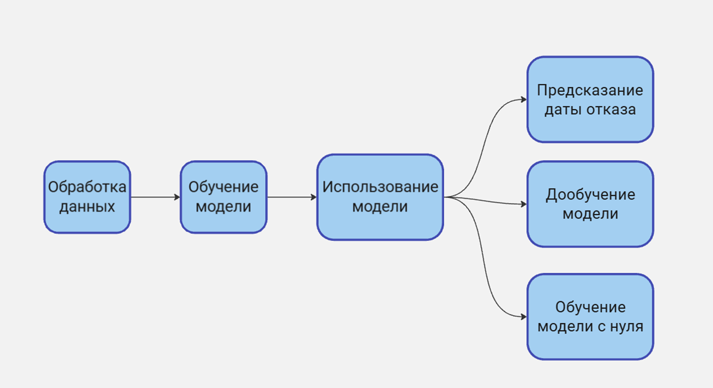
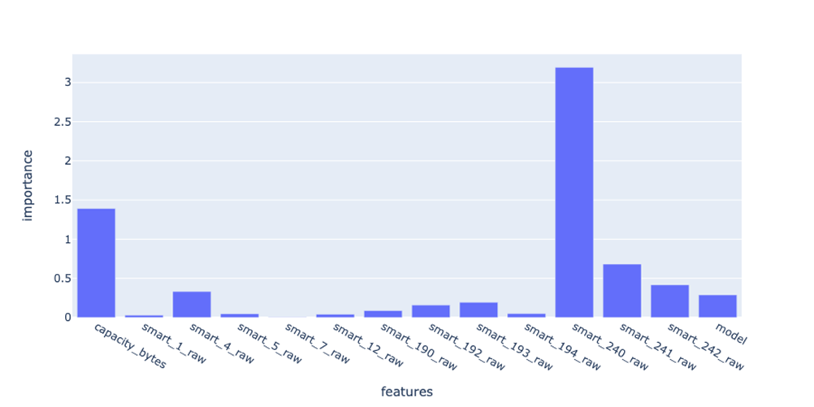
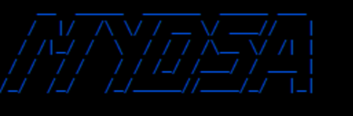

# Предсказание отказов оборудования
> Данный репозиторий является решением команды **ZhимоVики** на хакатоне *Цифровой прорыв 2024: сезон ИИ (Окружной хакатон СФО)*.

## Содержание

- [Задача](#Задача)
- [Концепция решения](#Концепция-решения)
- [Модель](#Модель)
- [Стек технологий](#Стек-технологий)
- [Обработка данных](#Обработка-данных)
- [Точность модели](#Точность-модели)
- [Масштабируемость и дообучение](#Масштабируемость-и-дообучение)
- [Запуск и использование](#Запуск-и-использование)
- [О команде](#О-команде)

---

## Задача

> Решить задачу автоматического предсказания сроков отказов дисков в
серверах. Для этого необходимо разработать одну или несколько моделей машинного обучения, способных прогнозировать дату отказа конкретного диска.

Разработка скрипта, который обучает и дообучает модель на
основе статистических данных. Модель должна быть способна предсказывать время выхода из строя накопителя. Интерфейс решения необходимо представить в виде утилиты командной строки, которая позволяет:
+ Обучать и дообучать модель на основе указанных CSV-файлов.
+ Оценивать дату и время выхода из строя диска по введённым данным.

---

## Концепция решения

Для реализации алгоритма машинного обучения выбрана регрессия. Модель предсказывает оставшееся время работы диска. Такой подход выбран поскольку ошибка в несколько дней работы диска менее критична, чем ошибка в несколько месяцев при классификации.

Программная реализация продукта имеет следующие возможности:

---

## Модель

Для реализации модели использовался метод градиентного бустинга.

---

## Стек технологий

+ Язык программирования: [Python 3.11+](https://www.python.org/)
+ [NumPy](https://numpy.org/) - для быстрых вычислений
+ [pandas](https://pandas.pydata.org/) - для удобного представления табличных данных и работы с ними
+ [scikit-learn](https://scikit-learn.org/stable/) - для препроцессинга данных и получения метрик точности модели
+ [xgboost](https://xgboost.ai/) - для обучения и дообучения модели
+ [optuna](https://optuna.org/) - оптимизация гиперпараметров модели

---

## Обработка данных

Отброшены малозначимые показатели S.M.A.R.T. Также выявлены наиболее важные параметры, от которых зависит оставшееся время работы диска:
+ **Head flying hours (240):** Общее время нахождения блока головок в рабочем положении в часах
+ **Capacity bytes:** Ёмоксть диска
+ **Total LBAs Written, Lifetime Writes from Host System (241):** У HDD — полное число записанных секторов; у SSD — объём записанного за всё время жизни накопителя, в гигабайтах
+ **Total LBAs Read, Lifetime Reads to Host System (242):** У HDD — полное число прочитанных секторов; у SSD — объём прочитаного за всё время жизни накопителя, в гигабайтах
+ **Start/Stop Count:** Полное число циклов «запуск-остановка» шпинделя. У дисков некоторых производителей (например, Seagate) — счётчик включения режима энергосбережения.
+ **Model:** Модель накопителя

> Если после обучения встречается неизвестная модель накопителя, которой не было во время обучения модели, она отмечается как UNKNOWN, и может быть добавлена в модель посредством дообучения.

---

## Точность модели

Предсказание оставшегося времени работы накопителя MSE = 0.003

R² 0.95 (1 - идеальный случай, 0 - лучшее константное решение)

---

## Масштабируемость и дообучение

Модель может дообучаться на основе incremental learning.

---

## Запуск и использование

Консольная утилита MYSDA работает с файлами формата .csv и имеет функционал:
+ определение оставшегося времени работы для каждого диска из поданного на вход файла
+ обучения модели на новых данных из файла .csv с нуля
+ дообучения модели на данных из файла .csv

---

## О команде

- [Яшин Данила](https://github.com/zibestr) (Team Lead, ML Engineer)
- [Основин Александр](https://github.com/PyAlexOs) (Full-stack Developer, Documentation)
- [Егоров Леонид](https://github.com/Grander78498) (Data Scientist, DevOps)
- [Корольков Александр](https://github.com/adkorolkov) (Backend, Data Engineer)
